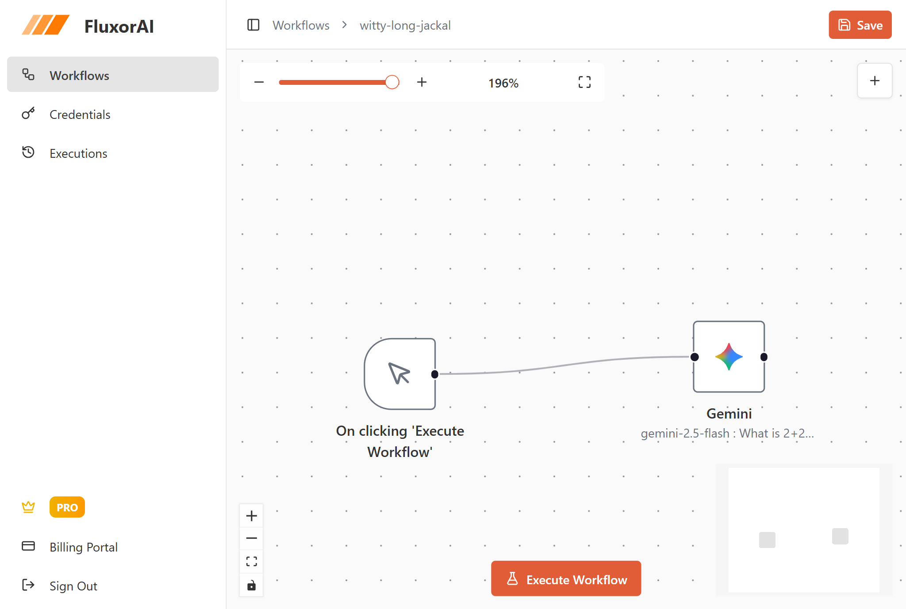
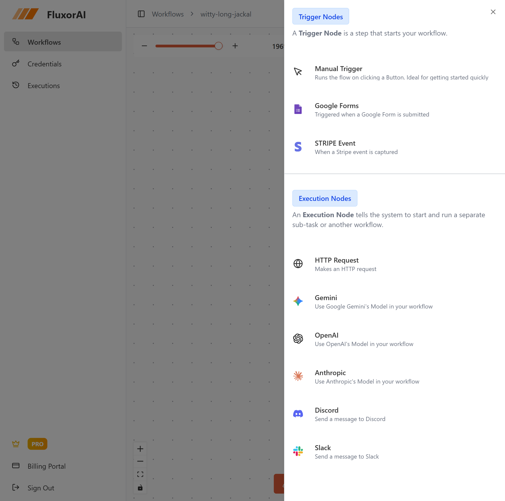
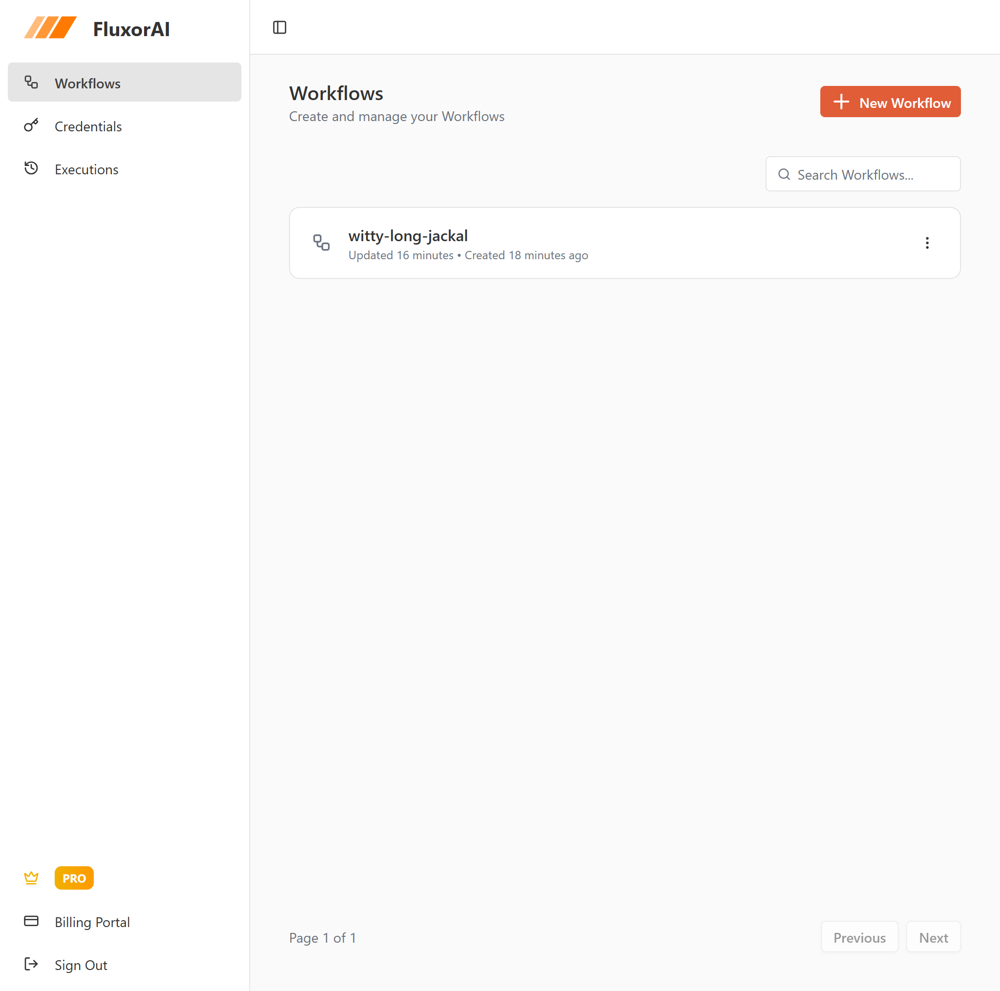

<div align="center">
  
  
  <h1>🔄 FluxorAI</h1>
  <p><strong>Visual Workflow Automation Platform with AI Integration</strong></p>
  
  
  
  
  
  
  <p>
    <a href="#-application-overview">Overview</a> •
    <a href="#-getting-started">Getting Started</a> •
    <a href="#-workflow-canvas">Workflow Canvas</a> •
    <a href="#-ai-integrations">AI Integrations</a> •
    <a href="#-trigger-nodes">Trigger Nodes</a> •
    <a href="#-messaging-integrations">Messaging</a> •
    <a href="#-execution-monitoring">Execution Monitoring</a> •
    <a href="#️-tech-stack">Tech Stack</a>
  </p>
</div>

---

## 📊 Application Overview

**FluxorAI** is a comprehensive visual workflow automation platform that empowers users to build intelligent workflows through an intuitive drag-and-drop interface. Built with cutting-edge technologies including Next.js 15, React Flow, Better Auth, Inngest, and tRPC, FluxorAI combines the power of multiple AI providers, real-time triggers, and messaging integrations to create a production-ready SaaS platform for workflow automation.

### Key Features

* **Visual Workflow Builder**: Drag-and-drop canvas powered by React Flow for intuitive workflow creation
* **Multiple AI Integrations**: Seamless integration with OpenAI, Claude (Anthropic), and Google Gemini
* **Smart Trigger Nodes**: Webhook, Google Forms, Stripe payments, and manual triggers
* **Messaging Automation**: Send automated messages via Discord and Slack
* **Background Job Execution**: Reliable workflow execution with Inngest and real-time updates
* **Variable & Templating System**: Dynamic data flow between nodes with template support
* **Secure Credential Management**: Encrypted API key storage with Cryptr
* **OAuth Integrations**: GitHub and Google authentication support
* **Payment & Subscriptions**: Full SaaS monetization with Polar integration
* **Execution History & Monitoring**: Track workflow runs with AI-powered error tracking via Sentry
* **Type-Safe API**: End-to-end type safety with tRPC and TypeScript
* **AI Code Reviews**: Automated PR reviews with CodeRabbit integration

Built for developers, entrepreneurs, and teams seeking to automate complex workflows without writing code, while maintaining enterprise-grade security and scalability.

---

## 🚀 Getting Started

### For New Users

<table>
<tr>
<td width="50%">


</td>
<td width="50%">

#### Create Your Account

1. **Sign Up**: Navigate to the signup page and create your account with email/password or OAuth providers (GitHub, Google)
2. **Secure Authentication**: Your account is protected by Better Auth with enterprise-grade security
3. **Email Verification**: Verify your email address to activate your account
4. **Access Dashboard**: Get redirected to your personalized dashboard
5. **Start Free Trial**: Automatically begin your 1-month free trial of FluxorAI PRO
6. **Start Building**: Access the visual workflow canvas and begin creating your first workflow

Our streamlined onboarding gets you started in seconds, with full access to all features during your free trial period.

</td>
</tr>
</table>

---

### For Existing Users

<table>
<tr>
<td width="50%">


</td>
<td width="50%">

#### Welcome Back

1. **Sign In**: Use your registered email and password, or continue with GitHub/Google OAuth
2. **Secure Session Management**: Powered by Better Auth for enterprise-grade security
3. **Instant Dashboard Access**: Get redirected directly to your workflows dashboard
4. **Resume Workflows**: Your saved workflows and execution history are automatically loaded
5. **Real-Time Sync**: All your data syncs seamlessly across devices

Your session is securely managed with encrypted data stored in Neon PostgreSQL, keeping your workflows and credentials safe and private.

</td>
</tr>
</table>

---

## 🎨 Workflow Canvas

<div align="center">
  
</div>

The heart of FluxorAI is the **Visual Workflow Canvas**—a powerful drag-and-drop interface built with React Flow that transforms complex automation into intuitive visual flows. The canvas is your command center for creating, editing, and managing workflows with professional-grade tools.

### Canvas Features

The **Workflow Builder** provides a comprehensive visual environment for automation design:

- **Drag-and-Drop Nodes**: Intuitively add trigger, AI, messaging, and HTTP nodes to your canvas
- **Node Connections**: Create logical flows by connecting nodes with visual edges
- **Real-Time Updates**: See workflow execution status update live with WebSocket integration
- **Minimap Navigation**: Quickly navigate large workflows with the built-in minimap
- **Node Configuration**: Click any node to configure settings, variables, and templates
- **Auto-Layout**: Intelligent node positioning for clean, organized workflows
- **Zoom & Pan Controls**: Smooth canvas navigation with mouse and keyboard shortcuts

### Node Types

<div align="center">
  
</div>

FluxorAI supports multiple node categories for building comprehensive workflows:

**Trigger Nodes**:
- **Webhook Trigger**: Receive HTTP requests to start workflows
- **Google Form Trigger**: Automatically execute workflows on form submissions
- **Stripe Trigger**: React to payment events and subscription changes
- **Manual Trigger**: Start workflows with a button click for testing

**AI Nodes**:
- **OpenAI Node**: Integrate OpenAI model
- **Claude Node**: Use Anthropic's Claude models for intelligent processing
- **Gemini Node**: Leverage Google's Gemini AI for advanced tasks

**Messaging Nodes**:
- **Discord Node**: Send automated messages to Discord channels
- **Slack Node**: Post updates to Slack workspaces and channels

**Utility Nodes**:
- **HTTP Request Node**: Make API calls to any external service

### Variable System & Templating

FluxorAI features a powerful **variable and templating system** that enables dynamic data flow:

- **Node Variables**: Each node can output data that becomes available to downstream nodes
- **Template Syntax**: Use `{{nodeName.output}}` syntax to reference variables from previous nodes
- **Type-Safe Variables**: Variables maintain type information for reliable execution
- **Real-Time Preview**: See variable values during workflow execution
- **Nested Data Access**: Access complex objects with dot notation (e.g., `{{trigger.data.email}}`)

**Example Workflow**:
```
Google Form Trigger → {{trigger.responses}}
↓
OpenAI Node → Process form data: {{trigger.responses.answer}}
↓
Slack Node → Send summary: {{ai.result}}
```

### Workflow Management

<div align="center">
  
</div>

The **Workflows Dashboard** provides comprehensive management capabilities:

- **Create Workflows**: Start new automation projects with a single click
- **Workflow Pagination**: Browse through your workflows with efficient pagination
- **Search & Filter**: Quickly find workflows by name or status
- **Execution Status**: See which workflows are running, completed, or failed
- **Version Control**: Track changes to your workflows over time

All workflow data is stored securely in Neon PostgreSQL with Prisma ORM, ensuring data integrity and type safety throughout the application.

---

## 🔐 Credentials Management

<div align="center">
  
</div>

FluxorAI provides a secure, dedicated **Credentials** section for managing your AI provider API keys and integration tokens. All credentials are encrypted using **Cryptr** before being stored in the database, ensuring enterprise-grade security for your sensitive data.

### Managing AI Provider Credentials

The **Credentials Tab** is your centralized hub for API key management:

**Supported AI Providers**:
- **OpenAI**: Add your OpenAI API key to use GPT-4 model
- **Anthropic (Claude)**: Store your Anthropic API key for Claude model
- **Google Gemini**: Configure your Google AI API key for Gemini.

**Adding Credentials**:
1. Navigate to **Credentials** from the sidebar
2. Select your AI provider (OpenAI, Anthropic, or Google)
3. Enter your API key from the provider's dashboard
4. Click **"Save"**
5. Your key is immediately encrypted with Cryptr and stored securely

**Security Features**:
- **End-to-End Encryption**: All API keys are encrypted using Cryptr before storage
- **Never Plain Text**: Keys are never stored in plain text in the database
- **User-Scoped**: Each user's credentials are isolated and only accessible to their workflows
- **No Exposure**: API keys are never exposed in logs, client-side code, or network requests
- **Secure Retrieval**: Keys are decrypted only during workflow execution in secure server environments


### Credential Usage

Once credentials are saved, they're automatically available across your workflows:

- **Auto-Selection**: AI nodes automatically use your saved credentials
- **No Re-Entry**: Never need to enter API keys when creating workflows
- **Seamless Integration**: Credentials are injected securely during execution
- **Multi-Provider**: Use different AI providers in the same workflow
- **Fallback Logic**: Configure backup credentials for high-availability scenarios

### Credential Management Features

**Update Credentials**:
- Click **"Edit"** next to any saved credential
- Enter new API key
- Old key is securely overwritten with new encrypted value

**Delete Credentials**:
- Remove credentials you no longer use
- Workflows using deleted credentials will fail with clear error messages
- Prevent unused keys from lingering in your account


**Validation**:
- Test credentials before saving to ensure they work
- Automatic validation during workflow execution
- Clear error messages when credentials fail
- Suggestions for fixing credential issues

### Security Best Practices

FluxorAI follows industry best practices for credential security:

1. **Encryption at Rest**: All credentials encrypted with Cryptr in Neon PostgreSQL
2. **Secure Transmission**: API keys transmitted over HTTPS only
3. **No Client Exposure**: Keys never sent to browser or client-side code
4. **Audit Logging**: Track when credentials are added, updated, or used
5. **Least Privilege**: Credentials only decrypted when absolutely necessary for execution

With FluxorAI's comprehensive credentials management, you can confidently use multiple AI providers and integrations knowing your sensitive API keys are protected with military-grade encryption and security best practices.

---

## 🤖 AI Integrations

<div align="center">
  
</div>

FluxorAI provides seamless integration with the world's leading AI providers, enabling you to build intelligent workflows that leverage cutting-edge language models. All AI integrations support secure credential management with encrypted API key storage.

### Supported AI Providers

**OpenAI Integration**:
- **Capabilities**: Text generation, completion, chat, embeddings, and function calling
- **Configuration**: Set temperature, max tokens, system prompts, and response format
- **Use Cases**: Content generation, data analysis, conversational AI, summarization

**Anthropic Claude Integration**:
- **Capabilities**: Advanced reasoning, long-form content, code generation, analysis
- **Configuration**: Customize temperature, token limits, and system instructions
- **Use Cases**: Complex analysis, technical writing, code review, research

**Google Gemini Integration**:
- **Capabilities**: Multimodal understanding, reasoning, generation
- **Configuration**: Fine-tune model parameters for optimal results
- **Use Cases**: Image analysis, content creation, question answering, translation

### AI Node Configuration

Each AI node in your workflow can be fully customized:

- **Prompt Templates**: Use variable templating to create dynamic prompts: `Analyze this data: {{trigger.input}}`
- **Response Handling**: Parse AI responses and make outputs available to subsequent nodes
- **Error Handling**: Automatic retries and fallback strategies for failed requests
- **Credential Auto-Loading**: Saved credentials from the Credentials tab are automatically used

**Note**: Before using AI nodes, ensure you've added your API keys in the **Credentials** section. All keys are encrypted and securely stored.

### AI-Powered Error Tracking

FluxorAI integrates **Sentry AI Monitoring** to provide intelligent error tracking:

- **LLM Call Monitoring**: Track all AI API requests, responses, and token usage
- **Error Insights**: Get AI-powered suggestions when workflows fail
- **Performance Metrics**: Monitor latency, token consumption, and costs
- **Debug Traces**: View detailed execution traces for failed AI nodes
- **Cost Tracking**: Monitor spending across all AI providers in real-time

With FluxorAI's AI integrations, you can build sophisticated automation workflows that leverage the latest advances in artificial intelligence—all while maintaining security, reliability, and cost efficiency.

---

## 🎯 Trigger Nodes

<div align="center">
  
</div>

Trigger nodes are the entry points for your workflows, determining when and how automation begins. FluxorAI supports multiple trigger types to accommodate diverse use cases, from real-time webhooks to manual execution.

### Webhook Trigger

The **Webhook Trigger** enables real-time workflow execution via HTTP requests:

- **Unique URLs**: Each workflow gets a unique webhook URL for receiving requests
- **HTTP Methods**: Support for POST, GET, PUT, DELETE methods
- **Request Data**: Automatically parses JSON, form-data, and query parameters
- **Headers & Authentication**: Validate requests with custom headers or bearer tokens
- **Response Customization**: Return custom HTTP responses to webhook callers
- **Use Cases**: API integrations, third-party notifications, real-time events

**Example Use Case**: Receive Stripe payment confirmations and automatically send Discord notifications to your team.

### Google Form Trigger

The **Google Form Trigger** connects FluxorAI to Google Forms submissions:

- **OAuth Integration**: Securely connect your Google account
- **Form Selection**: Choose which Google Form triggers your workflow
- **Response Mapping**: Automatically map form fields to workflow variables
- **Real-Time Execution**: Workflows execute immediately upon form submission
- **Type Detection**: Intelligently detects text, numbers, emails, and other field types
- **Use Cases**: Lead generation, survey processing, event registration, feedback collection

**Example Use Case**: When someone submits a contact form, use AI to categorize the inquiry and route it to the appropriate Slack channel.

### Stripe Trigger

The **Stripe Trigger** enables payment-driven automation:

- **Event Types**: Listen for payments, subscriptions, refunds, disputes, and more
- **Webhook Signing**: Secure webhook verification with Stripe signatures
- **Customer Data**: Access customer information, payment amounts, and metadata
- **Subscription Events**: Track subscription creation, updates, and cancellations
- **Payment Methods**: React to different payment method events
- **Use Cases**: Order fulfillment, subscription management, payment notifications, revenue tracking

**Example Use Case**: When a customer subscribes to your Pro plan, automatically send them a welcome email with AI-generated personalized onboarding content.

### Manual Trigger

The **Manual Trigger** allows on-demand workflow execution:

- **Test Button**: Execute workflows with a single click for testing
- **Custom Inputs**: Provide test data when manually triggering workflows
- **Debug Mode**: Run workflows step-by-step to troubleshoot issues
- **Scheduled Runs**: Set up cron-style schedules for recurring executions
- **Use Cases**: Testing, debugging, data migration, one-time operations

**Example Use Case**: Manually trigger a workflow to generate weekly reports using AI and send them to your team via Slack.

### Trigger Configuration

All trigger nodes share common configuration options:

- **Variable Outputs**: Define what data the trigger makes available to downstream nodes
- **Conditional Execution**: Set conditions that must be met for the workflow to run
- **Rate Limiting**: Prevent abuse by limiting trigger frequency
- **Error Handling**: Configure retry logic and fallback behaviors
- **Logging**: Track all trigger activations in the execution history

With FluxorAI's diverse trigger options, you can build workflows that respond to virtually any event—from user actions to payment transactions to scheduled intervals—creating a truly comprehensive automation platform.

---

## 💬 Messaging Integrations

<div align="center">
  
</div>

FluxorAI's messaging integrations enable your workflows to communicate with teams and users through popular platforms. Send automated notifications, alerts, and updates seamlessly integrated into your existing communication tools.

### Discord Integration

The **Discord Node** brings workflow automation to your Discord servers:

**Features**:
- **Webhook Support**: Send messages to any Discord channel via webhooks
- **Rich Embeds**: Create beautifully formatted messages with titles, descriptions, colors, and fields
- **Variable Templating**: Insert dynamic data from previous workflow nodes
- **File Attachments**: Attach images, documents, and other files to messages
- **Mentions & Roles**: Tag users and roles in automated notifications
- **Channel Selection**: Send messages to different channels based on workflow logic

**Configuration**:
1. Create a webhook in your Discord server settings
2. Copy the webhook URL to your Discord node configuration
3. Customize message content with variables: `New payment received: ${{stripe.amount}}`
4. Add embeds for professional-looking notifications
5. Test and deploy your workflow

**Example Use Cases**:
- Send payment confirmations to a #sales channel when Stripe triggers fire
- Post AI-generated summaries of Google Form submissions to #leads
- Alert your team about workflow failures with detailed error information
- Share daily reports compiled by AI to your #analytics channel

### Slack Integration

The **Slack Node** enables automation across Slack workspaces:

**Features**:
- **Webhook Integration**: Post messages to Slack channels via incoming webhooks
- **Channel Routing**: Send messages to different channels dynamically
- **Rich Formatting**: Use Slack's markdown for bold, italic, code blocks, and lists
- **Thread Support**: Reply to existing messages in threads
- **Block Kit Messages**: Create interactive messages with buttons and menus
- **User Mentions**: Tag team members with @mentions

**Configuration**:
1. Create an incoming webhook in your Slack workspace
2. Add the webhook URL to your Slack node configuration
3. Compose your message with variable templating
4. Select the target channel or use dynamic routing
5. Enable/disable notifications as needed

**Example Use Cases**:
- Notify #support when customers submit urgent Google Form requests
- Send AI-analyzed customer feedback to #product-team
- Post Stripe payment alerts to #revenue with formatted transaction details
- Share automated reports generated by OpenAI to #executives

### Message Templating

Both Discord and Slack nodes support FluxorAI's powerful templating system:

**Basic Variables**:
```
New submission from {{trigger.email}}
Amount: ${{stripe.amount}}
Status: {{ai.sentiment}}
```

**Conditional Content**:
```
{{trigger.priority === 'high' ? '🚨 URGENT' : 'ℹ️ Info'}}
Customer: {{stripe.customer.name}}
```

**AI-Enhanced Messages**:
```
AI Summary: {{openai.summary}}
Sentiment: {{claude.sentiment}}
Recommended Action: {{gemini.recommendation}}
```

### Error Notifications

Leverage messaging nodes for intelligent error handling:

- **Workflow Failures**: Automatically send alerts when workflows encounter errors
- **Retry Notifications**: Inform your team when workflows are retrying after failures
- **Success Confirmations**: Send completion messages for long-running workflows
- **Rate Limit Alerts**: Get notified when approaching API rate limits
- **Cost Monitoring**: Alert when AI token usage exceeds thresholds

With FluxorAI's messaging integrations, your workflows can communicate seamlessly with your team, ensuring everyone stays informed about critical events, customer interactions, and system status—all automated and intelligent.

---

## ⚡ Execution Monitoring

<div align="center">
  
</div>

FluxorAI provides comprehensive execution monitoring and observability, giving you complete visibility into your workflow performance, errors, and AI usage. Built on Inngest for reliable background job execution and Sentry for AI-powered error tracking.

### Real-Time Execution Updates

The **Execution Dashboard** provides live monitoring of workflow runs:

- **Live Status**: Watch workflows execute in real-time with WebSocket updates
- **Node-by-Node Progress**: See which nodes are running, completed, or failed
- **Execution Timeline**: View the complete execution flow from trigger to completion
- **Variable Inspection**: Examine data flowing between nodes during execution
- **Performance Metrics**: Track execution time for each node and overall workflow
- **Concurrent Runs**: Monitor multiple workflow executions simultaneously

### Execution History

The **Execution History** page maintains a complete audit trail:

- **All Executions**: Browse through every workflow run with pagination
- **Status Filtering**: Filter by success, failure, running, or pending status
- **Search Capability**: Find specific executions by workflow name or trigger data
- **Detailed Logs**: View comprehensive logs for each execution step
- **Replay Failed Runs**: Re-execute failed workflows with original trigger data
- **Export Data**: Download execution logs and results for analysis

**Execution Record Details**:
- Workflow name and ID
- Trigger type and source data
- Start time, end time, and duration
- Status (success, failed, running)
- Node execution breakdown
- Error messages and stack traces
- Output data from final nodes

### Background Job Execution with Inngest

FluxorAI uses **Inngest** for reliable, scalable workflow execution:

**Key Benefits**:
- **Asynchronous Processing**: Workflows run in the background without blocking user requests
- **Automatic Retries**: Failed nodes automatically retry with exponential backoff
- **Durability**: Execution state is persisted, surviving server restarts
- **Concurrency Control**: Manage parallel execution limits to prevent resource exhaustion
- **Step Functions**: Each node runs as an isolated step with guaranteed execution
- **Event-Driven**: Trigger workflows from any event source with guaranteed delivery

**Inngest Features Used**:
- **inngest.send()**: Queue workflow executions from trigger events
- **step.run()**: Execute individual nodes with automatic state management
- **step.sleep()**: Add delays between nodes for rate limiting
- **step.waitForEvent()**: Pause workflows until external events occur
- **Parallel Execution**: Run multiple nodes simultaneously when dependencies allow

### AI Monitoring with Sentry

FluxorAI integrates **Sentry's AI Monitoring** for intelligent observability:

**LLM Call Tracking**:
- **Request/Response Logging**: Capture all prompts sent to and responses received from AI providers
- **Token Consumption**: Track token usage per request and aggregate by workflow
- **Latency Metrics**: Measure AI API response times and identify slow requests
- **Error Detection**: Automatically flag failed AI calls with detailed error context
- **Cost Attribution**: Calculate costs based on model pricing and token usage

**Error Insights**:
- **Automatic Issue Grouping**: Sentry groups similar errors for efficient debugging
- **Stack Traces**: Full stack traces for server-side errors
- **Breadcrumbs**: Track the sequence of events leading to errors
- **User Context**: See which user triggered the failed workflow
- **Environment Data**: Capture Node.js version, dependencies, and environment variables

**AI-Powered Debugging**:
- **Root Cause Analysis**: Sentry AI suggests likely causes of workflow failures
- **Fix Suggestions**: Get AI-generated recommendations for resolving errors
- **Performance Insights**: Identify bottlenecks and optimization opportunities
- **Anomaly Detection**: Detect unusual patterns in workflow execution

### Real-Time Updates

FluxorAI provides live execution feedback through WebSockets:

- **Canvas Animation**: See nodes light up as they execute on the workflow canvas
- **Progress Indicators**: Visual progress bars for long-running AI operations
- **Status Badges**: Real-time status updates (running, success, failed) on each node
- **Variable Display**: View intermediate results as nodes complete
- **Error Highlighting**: Failed nodes immediately highlighted with error details

### Performance Analytics

Track workflow efficiency with built-in analytics:

- **Execution Time Distribution**: Histogram of workflow execution durations
- **Success/Failure Rates**: Track reliability metrics over time
- **AI Usage Trends**: Monitor token consumption and costs by provider
- **Trigger Activity**: See which triggers activate most frequently
- **Node Performance**: Identify slow nodes that need optimization

With FluxorAI's comprehensive execution monitoring, you have complete visibility into your automation workflows—from real-time execution updates to historical analysis, AI usage tracking, and intelligent error detection. Build with confidence knowing every execution is logged, monitored, and optimized.

---

## 💳 Payments & Subscriptions

<div align="center">
  
</div>

FluxorAI is a production-ready SaaS platform with subscription management powered by **Polar**. Start with a **1-month free trial** and seamlessly transition to paid subscription with flexible payment options for users worldwide.

### Subscription Plan

FluxorAI offers a single, comprehensive **PRO Plan** designed to provide full access to all features:

**FluxorAI PRO**:
- **Price**: $29/month (after trial)
- **Free Trial**: 1 month completely free
- **Unlimited Workflows**: Create and run as many workflows as you need
- **All Trigger Nodes**: Webhook, Google Forms, Stripe, and Manual triggers
- **All AI Integrations**: Full access to OpenAI, Claude, and Gemini
- **Unlimited Executions**: No limits on workflow runs
- **All Messaging Integrations**: Discord and Slack nodes included
- **Priority Support**: Fast response times from our support team
- **Execution History**: Complete audit trail of all workflow runs
- **Advanced Monitoring**: Sentry AI monitoring and error tracking
- **Credential Encryption**: Secure API key management with Cryptr

### 1-Month Free Trial

Every new user gets a **full-featured free trial**:

**Trial Features**:
- **No Credit Card Required**: Start building immediately without payment details
- **Full Feature Access**: Access every feature of FluxorAI PRO during trial
- **Unlimited Usage**: No restrictions on workflows, executions, or AI calls during trial
- **30 Days Free**: Full month to explore and build production workflows
- **Trial Expiration Notice**: Receive email reminders before trial ends
- **Seamless Upgrade**: One-click upgrade when ready to continue

**Trial Period**:
- Automatically activated upon account creation
- Runs from signup date for exactly 30 days
- No automatic charges - explicit upgrade required
- Option to cancel anytime with no obligations

### Polar Payment Integration

**Polar** provides enterprise-grade payment infrastructure designed for global SaaS businesses:

**Key Features**:
- **Global Currency Support**: Automatically handles currency conversion for users worldwide
- **Tax Compliance**: Built-in tax calculation for international customers
- **Stripe Integration**: Secure payment processing powered by Stripe
- **Payment Methods**: Credit cards, debit cards, and international payment options
- **Invoice Generation**: Automatic invoice creation for every transaction
- **Email Notifications**: Transactional emails for subscriptions, payments, and billing
- **Recurring Billing**: Automated monthly billing with retry logic for failed payments
- **Proration**: Fair billing adjustments for mid-cycle plan changes

### Subscription Activation Flow

<table>
<tr>
<td width="50%">


</td>
<td width="50%">

#### Starting Your Trial

1. **Create Account**: Sign up with email or OAuth (GitHub, Google)
2. **Instant Access**: Free trial automatically activated
3. **No Payment Required**: Start using all features immediately
4. **Build Workflows**: Create and execute workflows during trial
5. **30-Day Countdown**: Monitor trial expiration in dashboard

</td>
</tr>
</table>

---

<table>
<tr>
<td width="50%">


</td>
<td width="50%">

#### Upgrading to PRO

1. **Trial Reminder**: Receive email notification before trial expires
2. **One-Click Upgrade**: Click "Upgrade to PRO" button in dashboard
3. **Polar Checkout**: Redirected to secure Polar payment page
4. **Enter Payment**: Add credit card details via Stripe
5. **Instant Activation**: Subscription activated immediately
6. **Confirmation Email**: Receive welcome email with invoice

</td>
</tr>
</table>

### Billing & Invoice Management

<div align="center">
  
</div>

FluxorAI provides a comprehensive **Billing Section** for complete transparency and subscription management:

**Subscription Overview**:
- **Current Plan**: View active subscription tier (Trial or PRO)
- **Billing Cycle**: See current billing period and next renewal date
- **Payment Method**: Manage credit card and payment details
- **Subscription Status**: Active, trial, expired, or cancelled
- **Usage Metrics**: Track workflow executions and AI usage

**Invoice History**:
- **All Invoices**: Complete history of all billing transactions
- **Download PDFs**: One-click download of invoice PDFs
- **Payment Status**: See which invoices are paid, pending, or failed
- **Date & Amount**: Transaction date and charged amount
- **Invoice Numbers**: Unique identifiers for accounting purposes

<div align="center">
  
</div>

### Email Notifications & Invoices

FluxorAI sends automated emails for transparency and accountability:

**Subscription Emails**:
- **Welcome Email**: Sent upon trial activation with getting-started guide
- **Trial Reminder**: 7 days before trial expiration
- **Subscription Confirmation**: Immediate confirmation when upgrading to PRO
- **Payment Success**: Email receipt for every successful payment
- **Payment Failed**: Alert when payment fails with retry information
- **Subscription Cancelled**: Confirmation when subscription is cancelled

**Invoice Delivery**:
- **Automatic Generation**: Polar automatically generates PDF invoices
- **Email Attachment**: Invoices attached to payment confirmation emails
- **Invoice Details Include**:
  - Invoice number (e.g., `FLUXOR-AI-DEVELOPMENT-PRI-SCRGKWOIZX-0001`)
  - Date of issue
  - Billing period
  - Subscription description
  - Amount charged
  - Payment method
  - Billing address
  - Tax breakdown (if applicable)
  - Polar branding and compliance information

**Sample Invoice Email**:
```
Subject: Thank you for your subscription!

Your subscription to FluxorAI PRO is now active.

Order Summary:
Invoice Number: FLUXOR-AI-DEVELOPMENT-PRI-SCRGKWOIZX-0001
Date of Issue: January 15, 2026
Description: Trial period for FluxorAI PRO (Jan 15, 2026 - Feb 15, 2026)
Total: $0.00 (Free Trial)

[Access my purchase]

Next billing: February 15, 2026 - $29.00
```

### Global Tax & Currency Handling

Polar's international payment infrastructure ensures seamless billing worldwide:

**Currency Conversion**:
- Automatic detection of user's country and currency
- Real-time exchange rates for accurate pricing
- Display prices in local currency (USD, EUR, GBP, INR, etc.)
- Transparent conversion rates shown at checkout

**Tax Compliance**:
- Automatic VAT calculation for EU customers
- GST handling for applicable regions
- Sales tax for US states as required
- Tax identification number collection when needed
- Compliant invoicing with tax breakdowns

**Example**: A user in India sees pricing in INR, pays with local payment methods, and receives invoices with appropriate GST calculations—all handled automatically by Polar.

### Subscription Management

Users have full control over their subscription through the **Billing Section**:

**Available Actions**:
- **Update Payment Method**: Change credit card without interrupting service
- **View Invoices**: Access complete invoice history
- **Download Receipts**: PDF invoices for accounting and expense reports
- **Cancel Subscription**: Cancel anytime with prorated refunds
- **Reactivate**: Resume cancelled subscriptions easily
- **Billing Address**: Update billing information for accurate invoicing

**Cancellation Policy**:
- Cancel anytime, no questions asked
- Continue using FluxorAI until end of paid period
- No automatic renewals after cancellation
- Option to reactivate before period ends
- Export all workflow data before account closure

### Payment Security

FluxorAI and Polar maintain the highest security standards:

- **PCI Compliance**: Stripe ensures PCI DSS Level 1 compliance
- **No Stored Cards**: Credit card details never stored in FluxorAI database
- **Stripe Tokens**: Secure tokenization for all payment methods
- **3D Secure**: Support for additional authentication when required
- **Fraud Detection**: Stripe's advanced fraud prevention
- **Encrypted Transmission**: All payment data transmitted over HTTPS

With FluxorAI's comprehensive payment integration powered by Polar, you get transparent billing, global payment support, automatic invoicing, and complete subscription control—enabling you to focus on building powerful workflows while we handle the complexity of payment processing and international compliance.

---

## ⚙️ Tech Stack

FluxorAI is built with cutting-edge technologies to deliver a fast, reliable, and scalable workflow automation platform.

### Core Framework & Language

<table>
<tr>
<td width="50%">

**Next.js 15**

The latest version of the React framework for building full-stack web applications. It provides server-side rendering, App Router architecture, server components, and API routes, enabling developers to create optimized and scalable apps with excellent performance and SEO.

</td>
<td width="50%">

**TypeScript**

A statically typed superset of JavaScript that improves code quality, developer experience, and error detection. TypeScript is essential for building large-scale applications, providing auto-completion, type checking, and enhanced maintainability across the entire codebase.

</td>
</tr>
</table>

---

### Authentication & Database

<table>
<tr>
<td width="50%">

**Better Auth**

A modern, framework-agnostic authentication library for TypeScript. It provides built-in support for email/password login, social sign-on (GitHub, Google), session management, and role-based access control, simplifying user authentication and account management with type-safe APIs.

</td>
<td width="50%">

**Neon PostgreSQL**

A serverless Postgres platform that provides instant provisioning, autoscaling, and branching. Neon offers excellent performance with separation of compute and storage, making it ideal for modern applications requiring scalable, reliable database infrastructure.

</td>
</tr>
<tr>
<td colspan="2">

**Prisma ORM**

A next-generation ORM that provides type-safe database access with auto-generated TypeScript types. Prisma simplifies database operations with an intuitive API, automatic migrations, and excellent developer experience. It ensures type safety from database to application layer.

</td>
</tr>
</table>

---

### Workflow Automation & Background Jobs

<table>
<tr>
<td width="50%">

**React Flow**

A powerful library for building node-based editors and interactive diagrams. React Flow provides the visual canvas for FluxorAI's drag-and-drop workflow builder, offering features like zoom, pan, minimap, node connections, and custom node rendering with excellent performance.

</td>
<td width="50%">

**Inngest**

A platform for event-driven workflows and reliable background job execution. Inngest enables durable workflow execution with automatic retries, step functions, and event orchestration. It ensures workflows run reliably even during server failures or restarts.

</td>
</tr>
</table>

---

### AI & Integrations

<table>
<tr>
<td width="50%">

**OpenAI SDK**

Official TypeScript SDK for OpenAI's API, providing access to GPT-4, GPT-3.5-turbo, and other models. Enables text generation, completion, chat, embeddings, and function calling with streaming support and type-safe interfaces.

</td>
<td width="50%">

**Anthropic AI SDK**

Official SDK for Anthropic's Claude models. Provides access to Claude 3 Opus, Sonnet, and Haiku with advanced reasoning capabilities, long context windows, and constitutional AI principles for safe, helpful responses.

</td>
</tr>
<tr>
<td colspan="2">

**Google Generative AI**

Google's official SDK for Gemini models. Offers multimodal understanding with Gemini Pro and Gemini Pro Vision, enabling text, image, and video processing with state-of-the-art performance and integration with Google's AI ecosystem.

</td>
</tr>
</table>

---

### Type Safety & API

<table>
<tr>
<td width="50%">

**tRPC**

End-to-end type-safe API framework that eliminates the need for API schemas or code generation. tRPC provides automatic TypeScript types from backend to frontend, ensuring type safety across your entire application with excellent developer experience.

</td>
<td width="50%">

**TanStack React Query**

Powerful data fetching and state management library. React Query handles caching, background updates, and optimistic updates automatically, making FluxorAI's UI fast and responsive while synchronizing with the backend.

</td>
</tr>
</table>

---

### Real-Time Communication

<table>
<tr>
<td colspan="2">

**WebSockets**

FluxorAI uses WebSocket connections for real-time workflow execution updates. As workflows run, users see live status changes on the canvas, node-by-node progress, and variable values updating in real-time—providing instant feedback and excellent user experience.

</td>
</tr>
</table>

---

### Error Tracking & Monitoring

<table>
<tr>
<td width="50%">

**Sentry**

Application monitoring and error tracking platform with AI-powered insights. Sentry captures errors, performance issues, and LLM calls, providing detailed stack traces, breadcrumbs, and AI-suggested fixes to help debug and optimize FluxorAI workflows.

</td>
<td width="50%">

**Sentry AI Monitoring**

Specialized monitoring for AI/LLM applications. Tracks all AI API calls, token usage, latency, costs, and errors across OpenAI, Anthropic, and Google. Provides insights into AI performance and helps optimize prompt engineering and model selection.

</td>
</tr>
</table>

---

### Payment & Subscriptions

<table>
<tr>
<td colspan="2">

**Polar**

Modern payment and subscription infrastructure for SaaS businesses. Polar integrates with Stripe to handle recurring billing, usage tracking, invoice generation, and customer portal management, enabling FluxorAI's full monetization capabilities with minimal development effort.

</td>
</tr>
</table>

---

### Security

<table>
<tr>
<td colspan="2">

**Cryptr**

Encryption library for securing sensitive data like API keys and credentials. Cryptr ensures all user-provided AI provider keys, webhook URLs, and OAuth tokens are encrypted at rest in the database, maintaining security and compliance.

</td>
</tr>
</table>

---

### UI & Styling

<table>
<tr>
<td width="50%">

**Shadcn UI**

A collection of beautifully designed, accessible, and customizable React components built on Radix UI. Shadcn provides FluxorAI's polished interface with components like dialogs, dropdowns, forms, and tables—all fully customizable with TailwindCSS.

</td>
<td width="50%">

**TailwindCSS**

A utility-first CSS framework that enables rapid UI development without leaving HTML. Tailwind provides pre-defined classes for layouts, typography, colors, and responsive design, making FluxorAI's interface beautiful, consistent, and maintainable.

</td>
</tr>
<tr>
<td colspan="2">

**NeonDB**

A modern icon library providing beautiful, consistent icons for FluxorAI's interface. NeonDB icons are optimized for web performance and offer a cohesive visual language across the entire application.

</td>
</tr>
</table>

---

### Developer Tools

<table>
<tr>
<td colspan="2">

**CodeRabbit**

AI-powered code review tool that automatically analyzes pull requests. CodeRabbit provides intelligent suggestions, catches potential bugs, enforces coding standards, and improves code quality through automated PR reviews integrated into the development workflow.

</td>
</tr>
</table>

---

### Architecture Overview
```
┌─────────────────────────────────────────────────────────────┐
│                    FluxorAI Platform                         │
├─────────────────────────────────────────────────────────────┤
│  Frontend: Next.js 15 + TypeScript + React Flow             │
│  UI: TailwindCSS + Shadcn UI                                │
├─────────────────────────────────────────────────────────────┤
│  API Layer: tRPC + TanStack React Query                     │
├─────────────────────────────────────────────────────────────┤
│  Authentication: Better Auth (GitHub, Google, Email)         │
├─────────────────────────────────────────────────────────────┤
│  Workflow Engine: Inngest + WebSockets                      │
├─────────────────────────────────────────────────────────────┤
│  AI Integrations: OpenAI + Anthropic + Google Gemini        │
├─────────────────────────────────────────────────────────────┤
│  Messaging: Discord Webhooks + Slack Webhooks               │
├─────────────────────────────────────────────────────────────┤
│  Triggers: Webhooks + Google Forms + Stripe + Manual        │
├─────────────────────────────────────────────────────────────┤
│  Payments: Polar + Stripe                                   │
├─────────────────────────────────────────────────────────────┤
│  Database: Neon PostgreSQL + Prisma ORM                     │
├─────────────────────────────────────────────────────────────┤
│  Security: Cryptr (encryption) + Better Auth                │
├─────────────────────────────────────────────────────────────┤
│  Monitoring: Sentry + Sentry AI Monitoring                  │
├─────────────────────────────────────────────────────────────┤
│  DevOps: CodeRabbit (AI code reviews)                       │
└─────────────────────────────────────────────────────────────┘
```

This powerful, modern technology stack enables FluxorAI to deliver visual workflow automation with enterprise-grade reliability, security, scalability, and performance—all while maintaining excellent developer experience and type safety throughout the entire application.

---

## 📧 Contact

**[Your Name]** - [LinkedIn](https://www.linkedin.com/in/your-profile/)

Project Link: [https://fluxorai.vercel.app/](https://fluxorai.vercel.app/)

GitHub Repository: [https://github.com/yourusername/fluxorai](https://github.com/yourusername/fluxorai)

---

<div align="center">
  <p>Made with ❤️ for the automation community</p>
  <p>⭐ Star this repo if you find it helpful!</p>
</div>
